# Astro 入门知识图谱

下面这张图把我们目前讲过的知识点串起来了。

```mermaid
graph TD
    A[前端开发] --> B[网页本身]
    A --> C[前端工程化]

    B --> B1[HTML]
    B --> B2[CSS]
    B --> B3[JavaScript]

    C --> D[Node.js]
    C --> E[包管理与执行工具]
    C --> F[项目文件结构]
    C --> G[Astro 项目流程]

    D --> D1[Node.js 是 JS 运行时]
    D --> D2[让 JavaScript 脱离浏览器运行]
    D --> D3[支撑开发工具链]
    D --> D4[不是前端框架]

    D3 --> D31[读写文件]
    D3 --> D32[启动开发服务器]
    D3 --> D33[执行构建工具]
    D3 --> D34[运行脚本与测试]

    E --> E1[npm]
    E --> E2[npx]
    E --> E3[包 package]
    E --> E4[依赖 dependency]
    E --> E5[脚手架 scaffold]

    E1 --> E11[安装和管理包]
    E1 --> E12[依赖 Node.js]
    E1 --> E13[常见命令 npm install]
    E1 --> E14[常见命令 npm run dev]

    E2 --> E21[临时执行包命令]
    E2 --> E22[更偏向 运行]

    E3 --> E31[可复用代码或工具]
    E3 --> E32[例: astro vite react]

    E4 --> E41[项目正常运行所需的包]
    E4 --> E42[记录在 package.json]

    E5 --> E51[快速生成项目模板]
    E5 --> E52[例: npm create astro@latest]

    F --> F1[package.json]
    F --> F2[package-lock.json]
    F --> F3[node_modules]

    F1 --> F11[项目说明书]
    F1 --> F12[记录项目名 版本 脚本 依赖]
    F1 --> F13[scripts 如 dev build preview]

    F2 --> F21[锁定精确版本]
    F2 --> F22[保证不同环境安装尽量一致]

    F3 --> F31[真正存放依赖代码]
    F3 --> F32[npm install 后生成]

    F1 --> R1[声明我要什么]
    F2 --> R2[记录实际装了什么]
    F3 --> R3[保存真正装下来的东西]

    G --> G1[创建项目]
    G --> G2[安装依赖]
    G --> G3[启动开发服务器]
    G --> G4[构建生产版本]

    G1 --> G11[npm create astro@latest]
    G2 --> G21[npm install]
    G3 --> G31[npm run dev]
    G4 --> G41[npm run build]

    H[几个容易混淆的点] --> H1[Node.js 不是 Astro]
    H --> H2[Node.js 不是 npm]
    H --> H3[npm 不是 npx]
    H --> H4[npm init --yes 不是创建 Astro 项目]

    H1 --> H11[Node.js 是运行环境]
    H1 --> H12[Astro 是前端框架/站点生成工具]

    H2 --> H21[Node.js 提供运行环境]
    H2 --> H22[npm 是随 Node.js 附带的包管理工具]

    H3 --> H31[npm 更偏安装]
    H3 --> H32[npx 更偏执行]

    H4 --> H41[npm init --yes 只会生成普通 package.json]
    H4 --> H42[真正创建 Astro 项目通常用 npm create astro@latest]
```

## 一句话总结

- **Node.js**：运行环境
- **npm**：安装和管理包
- **npx**：执行包命令
- **package.json**：项目说明书
- **package-lock.json**：锁定依赖版本
- **node_modules**：依赖代码仓库
- **Astro**：用来开发现代网站的框架/工具

## Astro 学习主线

可以按这个顺序继续学：

1. Node.js、npm、npx 的关系
2. `package.json`、`package-lock.json`、`node_modules` 的关系
3. `npm install` 到底做了什么
4. `npm run dev` 为什么能启动 Astro
5. Astro 项目目录结构
6. `.astro` 文件是什么
7. 组件、布局、页面路由
8. 数据传递与模板语法
9. 静态站点生成与部署

---
title: '我的第一篇博客文章'
pubDate: 2022-07-01
description: '这是我 Astro 博客的第一篇文章。'
author: 'Astro 学习者'
image:
    url: 'https://docs.astro.build/assets/rose.webp'
    alt: 'The Astro logo on a dark background with a pink glow.'
tags: ["astro", "blogging", "learning in public"]
---

# 我的第一篇博客文章

 发表于：2022-07-01

 欢迎来到我学习关于 Astro 的新博客！在这里，我将分享我建立新网站的学习历程。

 ## 我做了什么

 1. **安装 Astro**：首先，我创建了一个新的 Astro 项目并设置好了我的在线账号。

 2. **制作页面**：然后我学习了如何通过创建新的 `.astro` 文件并将它们保存在 `src/pages/` 文件夹里来制作页面。

 3. **发表博客文章**：这是我的第一篇博客文章！我现在有用 Astro 编写的页面和用 Markdown 写的文章了！

 ## 下一步计划

 我将完成 Astro 教程，然后继续编写更多内容。关注我以获取更多信息。